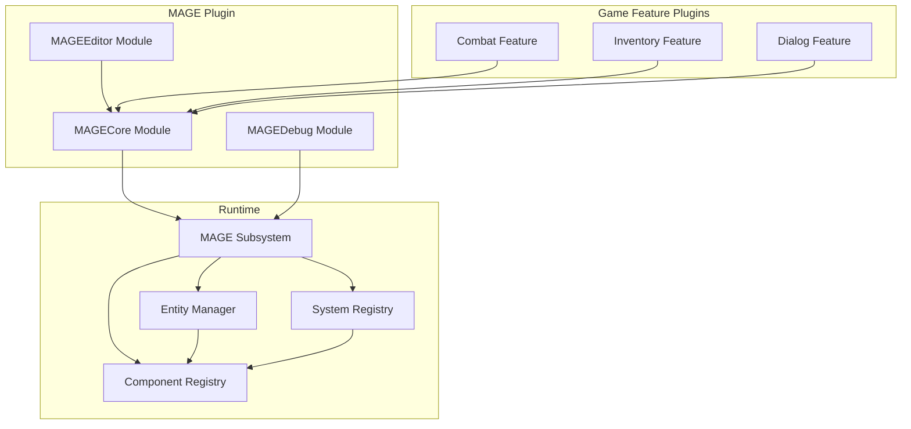

```mermaid
graph TD
    subgraph MAGE Plugin
        Core[MAGECore Module]
        Debug[MAGEDebug Module]
        Editor[MAGEEditor Module]
    end
    
    subgraph Game Feature Plugins
        Feature1[Combat Feature]
        Feature2[Inventory Feature]
        Feature3[Dialog Feature]
    end
    
    subgraph Runtime
        Subsystem[MAGE Subsystem]
        EntityMgr[Entity Manager]
        Systems[System Registry]
        Components[Component Registry]
    end
    
    Core --> Subsystem
    Debug --> Subsystem
    Editor --> Core
    
    Feature1 --> Core
    Feature2 --> Core
    Feature3 --> Core
    
    Subsystem --> EntityMgr
    Subsystem --> Systems
    Subsystem --> Components
    
    EntityMgr --> Components
    Systems --> Components
```