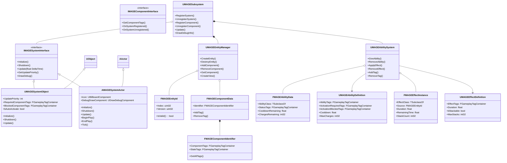

```mermaid
classDiagram
    %% Core Interfaces
    class IMAGESystemInterface {
        <<interface>>
        +Initialize()
        +Shutdown()
        +Update(float DeltaTime)
        +GetUpdatePriority()
        +DrawDebug()
    }

    class IMAGEComponentInterface {
        <<interface>>
        +GetComponentTags()
        +OnSystemRegistered()
        +OnSystemUnregistered()
    }

    %% Base Classes
    class UMAGESystemObject {
        +UpdatePriority: int
        +RequiredComponentTags: FGameplayTagContainer
        +BlockedComponentTags: FGameplayTagContainer
        +bAutoActivate: bool
        +Initialize()
        +Shutdown()
        +Update()
    }

    class AMAGESystemActor {
        +Icon: UBillboardComponent
        +DebugDrawComponent: UDrawDebugComponent
        +Initialize()
        +Shutdown()
        +Update()
        +BeginPlay()
        +EndPlay()
        +Tick()
    }

    %% Entity System
    class FMAGEEntityId {
        +Index: uint32
        +Version: uint32
        +IsValid(): bool
    }

    class UMAGEEntityManager {
        +CreateEntity()
        +DestroyEntity()
        +AddComponent()
        +RemoveComponent()
        +GetComponent()
        +CreateView()
    }

    %% Component System
    class FMAGEComponentData {
        +Identifier: FMAGEComponentIdentifier
        +AddTag()
        +RemoveTag()
    }

    class FMAGEComponentIdentifier {
        +ComponentTags: FGameplayTagContainer
        +StateTags: FGameplayTagContainer
        +GetAllTags()
    }

    %% Subsystem
    class UMAGESubsystem {
        +RegisterSystem()
        +UnregisterSystem()
        +RegisterComponent()
        +UnregisterComponent()
        +Update()
        +DrawDebugInfo()
    }

    %% Ability System
    class UMAGEAbilitySystem {
        +GiveAbility()
        +RemoveAbility()
        +ApplyEffect()
        +RemoveEffect()
        +AddTag()
        +RemoveTag()
    }

    class FMAGEAbilityData {
        +AbilityClass: TSubclassOf
        +StatusTags: FGameplayTagContainer
        +CooldownRemaining: float
        +ChargesRemaining: int32
    }

    class UMAGEAbilityDefinition {
        +AbilityTags: FGameplayTagContainer
        +ActivationRequiredTags: FGameplayTagContainer
        +ActivationBlockedTags: FGameplayTagContainer
        +Cooldown: float
        +MaxCharges: int32
    }

    %% Effect System
    class FMAGEEffectInstance {
        +EffectClass: TSubclassOf
        +Source: FMAGEEntityId
        +Duration: float
        +RemainingTime: float
        +StackCount: int32
    }

    class UMAGEEffectDefinition {
        +EffectTags: FGameplayTagContainer
        +Duration: float
        +bStackable: bool
        +MaxStacks: int32
    }

    %% Relationships
    IMAGESystemInterface <|-- UMAGESystemObject
    IMAGESystemInterface <|-- AMAGESystemActor
    UObject <|-- UMAGESystemObject
    AActor <|-- AMAGESystemActor

    UMAGESubsystem *-- UMAGEEntityManager
    UMAGESubsystem *-- UMAGEAbilitySystem
    UMAGESubsystem o-- IMAGESystemInterface

    UMAGEEntityManager o-- FMAGEEntityId
    UMAGEEntityManager o-- FMAGEComponentData

    FMAGEComponentData *-- FMAGEComponentIdentifier

    UMAGEAbilitySystem o-- FMAGEAbilityData
    UMAGEAbilitySystem o-- FMAGEEffectInstance
    UMAGEAbilitySystem --> UMAGEAbilityDefinition
    UMAGEAbilitySystem --> UMAGEEffectDefinition
```