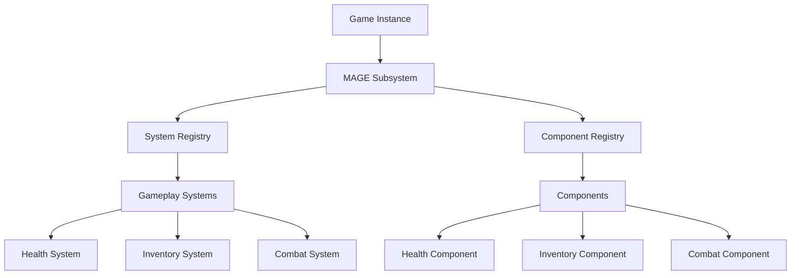

# MAGE Framework
## Modular Actor Gameplay Extension System

MAGE is a high-performance, modular gameplay framework for Unreal Engine that bridges ECS principles with Unreal's actor-component model. It provides a structured approach to building scalable game systems while maintaining compatibility with Unreal Engine's ecosystem.

[](LICENSE.md)
[](https://www.unrealengine.com)

## Overview

MAGE combines the best aspects of Entity Component System (ECS) architecture with Unreal Engine's native patterns:

- **Data-Oriented Design**: Clear separation between data (components) and logic (systems)
- **Modular Architecture**: Systems are isolated, maintainable, and easily toggled
- **Performance Focused**: Optimized component updates without per-frame ticking
- **Unreal Integration**: Seamless integration with Unreal Engine's features
- **Game Feature Plugins**: Built on UE's modular gameplay feature system
- **Event-Driven**: Rich event system for component communication

## Key Features

- 🏗️ **Modular Systems**: Self-contained gameplay systems that can be enabled/disabled at runtime
- 🎮 **Game Feature Integration**: Built on UE's game feature plugin system
- 🔌 **Component Framework**: Lightweight, data-focused components
- ⚡ **Event System**: Robust event handling between components and systems
- 🎯 **Tag-based Queries**: Efficient component queries using gameplay tags
- 🛠️ **Development Tools**: Debug visualization and system monitoring
- 📊 **Performance Tools**: Built-in profiling and optimization utilities

## Architecture Overview



## Development Roadmap

### Phase 1: Foundation (Q1 2025)
- [x] Core framework architecture
- [x] Basic component system
- [x] System management
- [x] Event handling
- [ ] Documentation framework
- [ ] Basic example project
- [ ] Unit testing framework

### Phase 2: Core Systems (Q2 2025)
- [ ] Health/Damage system
- [ ] Inventory system
- [ ] Basic AI system
- [ ] Interaction system
- [ ] Save/Load system
- [ ] Performance profiling
- [ ] Debug visualization

### Phase 3: Advanced Features (Q3 2025)
- [ ] Network replication
- [ ] Advanced AI behaviors
- [ ] Quest system
- [ ] Dialog system
- [ ] Advanced inventory
- [ ] Crafting system
- [ ] Achievement system

### Phase 4: Enterprise & Tools (Q4 2025)
- [ ] Visual system editor
- [ ] Advanced debugging tools
- [ ] Performance optimization tools
- [ ] System dependency visualization
- [ ] Component relationship viewer
- [ ] Enterprise deployment tools
- [ ] Advanced monitoring

### Phase 5: Ecosystem (2026)
- [ ] Marketplace integration
- [ ] Plugin ecosystem
- [ ] Community tools
- [ ] Advanced examples
- [ ] Training materials
- [ ] Integration guides
- [ ] Performance benchmarks

## Getting Started

1. **Installation**
```bash
# Clone the repository
git clone https://github.com/your-org/mage-framework.git

# Add to your project's plugins directory
cp -r mage-framework/MAGE [YourProject]/Plugins/
```

2. **Basic Setup**
```cpp
// Enable the plugin in your project
// Edit [YourProject].uproject:
{
    "Plugins": [
        {
            "Name": "MAGE",
            "Enabled": true
        }
    ]
}
```

3. **Create Your First System**
```cpp
UCLASS()
class UHealthSystem : public UMAGESystem
{
    GENERATED_BODY()
public:
    virtual void Initialize() override;
    virtual void Update(float DeltaTime) override;
};
```

## Example Usage

```cpp
// Create a component
UCLASS()
class UHealthComponent : public UMAGEComponent
{
    GENERATED_BODY()
    
public:
    UPROPERTY(EditAnywhere)
    float MaxHealth = 100.0f;
    
    UPROPERTY(Replicated)
    float CurrentHealth = 100.0f;
};

// Create a game feature
UCLASS()
class UHealthFeature : public UMAGEFeatureData
{
    GENERATED_BODY()
    
public:
    UHealthFeature()
    {
        SystemClasses.Add(UHealthSystem::StaticClass());
    }
};
```

## Contributing

We welcome contributions! Please read our [Contributing Guide](CONTRIBUTING.md) for details on our code of conduct and the process for submitting pull requests.

## License

MAGE is available under two licenses:

- **Community License**: Free for indie developers and companies with revenue under $1M USD
- **Enterprise License**: For larger companies and commercial projects

See [LICENSE.md](LICENSE.md) for details.

## Support

- 📚 [Documentation](docs/README.md)
- 💬 [Discord Community](https://discord.gg/mage)
- 🐛 [Issue Tracker](https://github.com/your-org/mage/issues)
- 📧 [Professional Support](https://mage-framework.com/support)

## Enterprise Features

The Enterprise version includes additional features:
- Advanced monitoring tools
- Deployment automation
- Priority support
- Training materials
- Custom integration support

Contact sales@mage-framework.com for enterprise licensing.

## Project Status

MAGE is currently in active development. We follow semantic versioning and maintain a detailed [changelog](CHANGELOG.md).

Would you like me to elaborate on any particular aspect of the framework or add more details to specific sections of the roadmap?