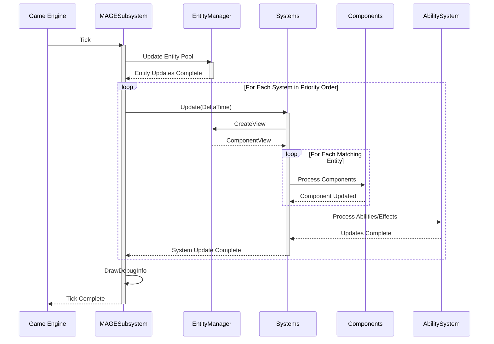

```mermaid
sequenceDiagram
    participant Game Engine
    participant MAGESubsystem
    participant EntityManager
    participant Systems
    participant Components
    participant AbilitySystem
    
    Game Engine->>MAGESubsystem: Tick
    activate MAGESubsystem
    
    MAGESubsystem->>EntityManager: Update Entity Pool
    activate EntityManager
    EntityManager-->>MAGESubsystem: Entity Updates Complete
    deactivate EntityManager
    
    loop For Each System in Priority Order
        MAGESubsystem->>Systems: Update(DeltaTime)
        activate Systems
        
        Systems->>EntityManager: CreateView
        EntityManager-->>Systems: ComponentView
        
        loop For Each Matching Entity
            Systems->>Components: Process Components
            Components-->>Systems: Component Updated
        end
        
        Systems->>AbilitySystem: Process Abilities/Effects
        AbilitySystem-->>Systems: Updates Complete
        
        Systems-->>MAGESubsystem: System Update Complete
        deactivate Systems
    end
    
    MAGESubsystem->>MAGESubsystem: DrawDebugInfo
    MAGESubsystem-->>Game Engine: Tick Complete
    deactivate MAGESubsystem
```